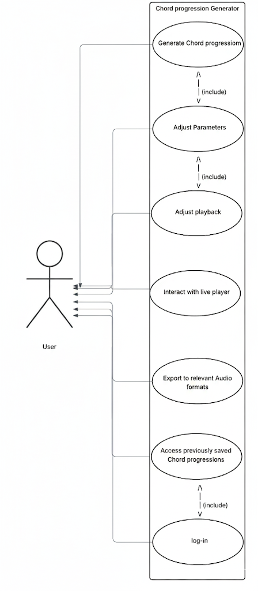

# Deliverable 2 - Requirements
Group 02 – “Musical Chord Progression Generator”

## 1. Positioning

### 1.1 Problem Statement
The problem of difficult learning/composing of complex music affects musicians of all levels; the impact of which is their music lacking identity, or worse, the musician not understanding music at all.

### 1.2 Product Position Statement
For musicians interested in the chord progression music theory, [app name] is a web-app music-making tool that suggests a wide range of chord progressions to the user, giving them the opportunity to listen and test suggestions on the go; unlike other music-making tools such as Hooktheory and Scaler Music, our product isolates and partially automates the process of creating chord progressions to make learning/implementing them as easy as possible.

### 1.3 Value Proposition
Value proposition: [app name] is a web-app music-making tool that assists musicians interested in the chord progression music theory, allowing them to generate, listen to, and export chord progressions for whatever they need.
Consumer segment: Musicians interested in the music theory of chord progressions

## 2. Stakeholders
<u>Developers</u> 
Developers are the ones responsible for creating the application according to its specifications.  This includes iterating on the app, adding/removing/improving features as they go along.

<u>Testers/users</u> 
Future testers/users will be responsible for evaluating the application for usability, performance, and other requirements.  Some users may give feedback, allowing developers to properly iterate on the app.

<u>Music community</u> 
If trends in the music community shift, so do the most popular progressions, affecting the algorithm that suggests chord progressions to the user as well as each one’s description.

<u>Competitors</u> (eg. Hooktheory and Scaler Music) 
Other similar apps set the bar for what [app name] should provide to the user.  If they set a high standard, the app needs to match—and in some aspects, surpass—that standard.

## 3. Functional requirements (features)
<ol>
    <li>Users can generate and view chord progressions based on key, scale, and complexity</li>
    <li>Users can add, remove, and adjust individual tones in their generated chord progressions</li>
    <li>Users can adjust the length and timing of individual notes in their generated chord progressions</li>
    <li>Users can listen to their generated chord progressions</li>
    <li>Users can export their generated chord progressions in their preferred format</li>
    <li>Users can adjust the time signature of their generated chord progressions</li>
    <li>Users can select the instrument that plays their generated chord progressions</li>
    <li>Users can adjust the playback style of their generated chord progressions</li>
    <li>Users can adjust the tempo of their generated chord progressions</li>
    <li>Users can adjust the looping behavior of their generated chord progressions</li>
    <li>Users can create and log into personal accounts</li>
    <li>Users can save generated chord progressions to their account</li>
    <li>Users can edit generated chord progressions saved under their account</li>
    <li>Users can manage personal account settings/preferences</li>
</ol>

## 4. Non-functional requirements
<ol>
    <li>Usability - The system shall support the modification, playing, and exporting of sixteenth-notes at minimum</li>
    <li>Compatibility - The system shall support, at minimum, MIDI, MP3, and WAV file export formats</li>
    <li>Performance - The system shall start audio playback within 200ms of the user requesting it</li>
    <li>Security - The system shall use a database that encrypts user data via SHA-256 hashing</li>
    <li>Reliability - The system shall maintain at least 99% uptime</li>
    <li>Scalability - The system shall use a database that can support at least 100000 total generated chord progressions</li>
    <li>Resource constrained - Webpages shall take up no more than 5MB of space each</li>
    <li>Portability - The system shall host a responsive UI that works with screens of width 360px at minimum and 1920px at maximum</li>
    <li>Maintainability - The codebase shall host automated tests that completely cover at least 80% of all webpages at any given time</li>
</ol>

## 5. MVP
The minimum viable product (MVP) for [app name] will prioritize the user's ability to create, modify, and listen to their chord progressions.  This means that key/scale/complexity selection, individual note modification and listening will come first, with the piano being the default instrument. From there, we’ll perform interviews revolving around the product and play it by ear, asking if they are satisfied with their experience and what else they’d want to see in the app, if anything.  In the absence of user feedback, functional requirements will be implemented going down the list (with the topmost ones holding more priority).  If feedback is present, functional requirements will be modified to suit the needs of a wider user base.  Afterwards, the process will be repeated, gathering more user feedback via interviews or online means (eg. Google Forms).

## 6. Use Cases
### 6.1 use case diagram

### 6.2 Use case descriptions and interface sketch
**Use Case:** Generate Chord Progression  
**Actors:** Musician  
**Description:** This use case allows the musician to automatically generate a new chord progression based on chosen parameters such as key, style, and complexity. The system provides a starting point for musical ideas that the musician can further adjust, save, and use in their creative process.  

**Pre-Condition:**

- The musician enters the website
- The musician is logged in

**Post-Condition:**

- The musician can see the generated chord progression 
- The musician is able to modify it to their needs
- The musician can save the chord progression to their account

**Alternative flows:**  

2a. The musician closes the generate window

     -The system brings the musician back to the main page
     
3a.	Invalid parameters provided

- The system can’t generate the chord progression
- The system displays an error message identifying invalid parameters
- The system allows the musician to place new parameters and try again

**Use Case:** Interacting with Live Player  
**Actors:** Musician  
**Description:** The musician interacts with a live audio player to play, pause, stop, or adjust the chord progression in real time.  

**Pre-Condition:** 

- The musician enters the website
- The musician is logged in
- A chord progression is available for playback

**Post-Condition:** 

- The live player reflects the musician’s interactions
- The musician hears real-time adjustments to playback

**Main flow:**

- The musician selects desire chord progression
- The musician selects “Play in Live Player” option
- The musician performs actions (play, pause, stop, adjust volume, etc.)
- The system applies changes instantly in playback

**Alternative flows:**
3a. Live player fails to load
- The system displays an error message
- The musician is asked to try again

**Use Case:** Export to relevant Audio format  
**Actors:** Musician  
**Description:** This use case enables the musician to convert a generated or saved chord progression into a downloadable audio file (e.g., WAV, MP3, MIDI). The exported file can then be stored on the musician's personal device for playback, sharing, or integration into other music software.  

**Pre-Condition:**

- The musician enters the website
- The musician is logged in
- The musician has a chord progression ready to be exported

**Post-Condition:**

- The musician will have their chord progression as a file
- The musician is able to save this file on their personal device

**Main flow:**

- The musician selects desired chord progression
- The musician selects "Export as…" option
- The musician selects desired parameters of the export (name, file extension, etc.)
- The musician selects "Export" option
- The system creates the file
- The musician selects "Download" option

**Alternative flows:**

3a. Musician cancels export

- The system brings the musician back to the previous window

4a. Invalid parameters provided

- The system can't export chord progression
- The system displays an error message identifying invalid parameters
- The system allows the musician to place new parameters and try again

5a. Website not responding

- The system displays an error message and ask the musician to try again

**Use Case:** Access previous saved chord progressions  
**Actors:** Musician  
**Description:** The musician retrieves and reviews chord progressions saved in their account.  

**Pre-Condition:**

- The musician enters the website
- The musician is logged in
- The musician has previously saved chord progressions

**Post-Condition:**

- The musician can view, play, adjust, or export saved chord progressions

**Main flow:**

- The musician selects "My Saved Progressions"
- The system displays a list of previously saved chord progressions
- The musician selects desired chord progression
- The system loads the chord progression for review or editing

**Alternative flows:**

3a. No saved chord progressions exist

- The system displays a message
- The musician is given the option to create a new chord progression

**Use Case:** Adjust Parameters  
**Actors:** Musician  
**Description:** The musician customizes the generated chord progression by modifying the parameters such as tempo, key, style, or instrument sound.  

**Pre-Condition:**

- The musician enters the website
- The musician is logged in
- The musician has a chord progression already generated

**Post-Condition:**

- The chord progression is updated to reflect new parameters
- The musician can continue playback, export, or save the adjusted progression

**Main flow:**

- The musician opens desired chord progression
- The musician opens the parameter adjustment window
- The musician adjust parameters of the chord progression
- The system applies changes and updates the chord progression
- The musician confirms adjustments

**Alternative flows:**

3a. Invalid parameter values provided

- The system displays an error message
- The system allows the musician to correct the values and try again

**Use Case:** Log in  
**Actors:** Musician  
**Description:** The musician authenticates with the system to access features requiring an account  

**Pre-Condition:**

- The musician enters the website

**Post-Condition:**

- The musician is able to log into their account and can access all features tied to the account

**Main flow:**

- The musician selects "Log In" option
- The system prompts for username/email and password
- The musician enters valid credentials
- The system verifies the credentials
- The musician gains access to their account

**Alternative flows:**

3a. Invalid credentials provided

- The system displays an error message
- The system allows the musician to retry

3b. Forgot password selected

- The system directs the musician to password recovery

3c. Sign up selected

- The system directs the musician to create a new account
- The musician provides their credentials
- The system validates these credentials
- The system brings the musician to the log in screen to log in

## 7. User Stories

1. As a Musician, I want to decide the key of the chord progression so that I can narrow in on the emotional tonality I desire
- Priority: 8/10
- Number of hours: 1

2. As a Musician, I want to export my generated chord progression to midi so that I can use it in my DAW
- Priority: 5/10
- Number of hours: 20

3. As a Musician, I want to be able to hear the chord progression in real time so that I can decide if I like it
- Priority: 2/10
- Number of hours: 256

4. As a Musician, I want to save my chord progression so that I can use it later to create a piece using that progression
- Priority: 3/10
- Number of hours: 20

5. As a Musician, I want to use inversions so that I can get more complex emotions from my chords
- Priority: 7/10
- Number of hours: 5

6. As a Piano student, I want a tool to help me practice chord naming so that I can work on my chord naming proficiency
- Priority: 7/10
- Number of hours: 3

7. As a Worship Group Leader, I want to change the key of songs that have chords so that the whole church can sing certain songs.
- Priority: 4 /10
- Number of hours: 4

8. As a Song Writer, I want chord progressions that I don't normally use so that the music I write does not use the same chords repeatedly.
- Priority: 5/10
- Number of hours: 3

9. As a Jazz musician, I want to practice using less common chord progressions so that I can change keys smoothly and play well in the new key
- Priority: 7 /10
- Number of hours: 7

10. As a music educator, I want create multiple chords progressions so that i can test students on their chord progression, and key understanding
- Priority: 3 /10
- Number of hours: 2

11. As a beginner musician, I want to generate random chords so that I can quickly find inspiration for musical pieces without having to have a deep knowledge of music theory
- Priority: 9/10
- Number of hours: 2

12. As a guitarist, I want to see the chord diagram for each chord so that I can immediately play it on my instrument
- Priority: 7 /10
- Number of hours: 4

## 8. Issue Tracker
[issue tracker link](https://github.com/EthanSNAU/CS386_project/issues)
