# **Deliverable 4 \- Implementation 1**

## Group 02 – “Musical Chord Progression Generator”

# 1\. Introduction

## 1.1 Description

In music theory, a chord progression is a sequence of chords that acts as the backing to a piece of music.  Because many musicians compose music centered around them, Musegen aims to streamline the process of generating, reading, and listening to chord progressions.  Primary features include the ability to test suggestions, modify individual chords/notes, and save/load projects.  In doing so, we aim to make learning and implementing chord progressions as easy as possible.

**Changes made**: Little to none

## 1.2 Value Proposition

**Value proposition**: Musegen is a web-app music-making tool that assists musicians interested in chord progression music theory, allowing them to generate, listen to, and export chord progressions for whatever they need.

**Consumer segment**: Musicians interested in the music theory of chord progressions

**Changes made**: Little to none

## 1.3 MVP

The minimum viable product (MVP) for Musegen focuses on the user’s ability to create and modify chord progressions.  As it stands, chord progressions can be randomly generated (along with their inversions and root notes), and the user has the power to modify any individual chord to their liking.  This includes the ability to randomize certain properties of their selected chord, such as the inversion, root note, and any additional notes they would like to overlay on top of it.  The user may also specify how long they want their chord progression to be, being able to dynamically add or remove chords as they see fit.

**Changes made**: Listening to chord progressions has been removed (but remains a top priority)

## 1.4 Repository

[https://github.com/EthanSNAU/CS386\_project](https://github.com/EthanSNAU/CS386_project)

# 2\. Implemented Requirements

## 2.1 Adolfo Lopez Villanueva

**Pull requests**: [https://github.com/EthanSNAU/CS386\_project/pulls?q=is%3Apr+author%3ALatestStream+](https://github.com/EthanSNAU/CS386_project/pulls?q=is%3Apr+author%3ALatestStream+)  
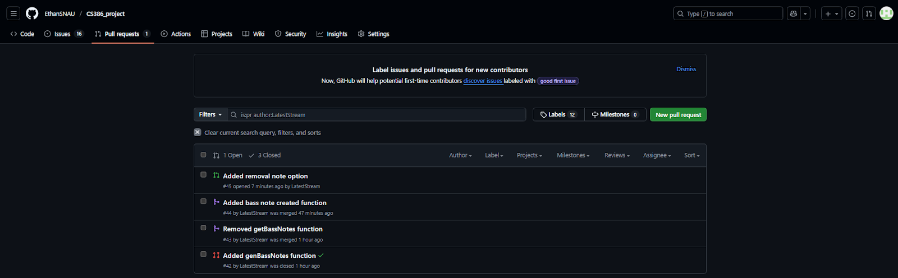

### 2.1.1 Added bass note created function

**Requirement**:As a musician, I want to add notes to individual chords so that I can learn about different bass tones  
**Issue**: [https://github.com/EthanSNAU/CS386\_project/issues/30](https://github.com/EthanSNAU/CS386_project/issues/30)  
**Pull request**: [https://github.com/EthanSNAU/CS386\_project/pull/44](https://github.com/EthanSNAU/CS386_project/pull/44)  
**Implemented by**: Adolfo Lopez Villanueva  
**Approved by**: Ethan Sudol  
**Automated Tests**: [https://github.com/EthanSNAU/CS386\_project/blob/main/tests/unit/romanNumGen.test.js](https://github.com/EthanSNAU/CS386_project/blob/main/tests/unit/romanNumGen.test.js)  
**Visual evidence**:
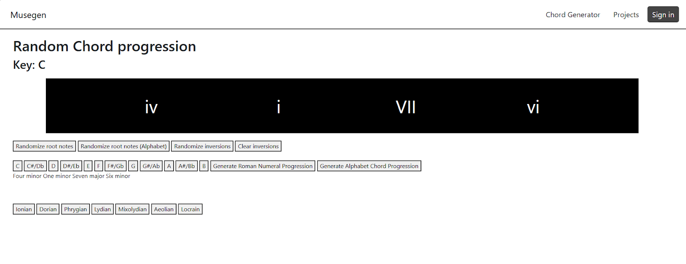

### 2.1.2 Added removal note option

**Requirement**: As a musician, I want to remove individual notes from chords so that I can learn about minimalist chords  
**Issue**: [https://github.com/EthanSNAU/CS386\_project/issues/31](https://github.com/EthanSNAU/CS386_project/issues/31)  
**Pull request**: [https://github.com/EthanSNAU/CS386\_project/pull/45](https://github.com/EthanSNAU/CS386_project/pull/45)  
**Implemented by**: Adolfo Lopez Villanueva  
**Approved by**: Ethan Sudol  
**Automated Tests**: [https://github.com/EthanSNAU/CS386\_project/blob/main/tests/unit/romanNumGen.test.js](https://github.com/EthanSNAU/CS386_project/blob/main/tests/unit/romanNumGen.test.js)  
**Visual evidence**:
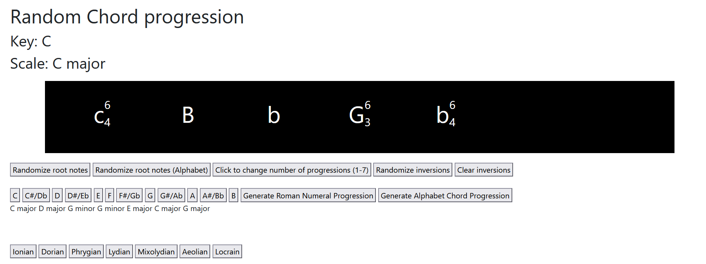

## 2.2 Benjamin Jones

**Pull requests**: [https://github.com/EthanSNAU/CS386\_project/pulls?q=+is%3Apr+author%3Abjones55+](https://github.com/EthanSNAU/CS386_project/pulls?q=+is%3Apr+author%3Abjones55+)   
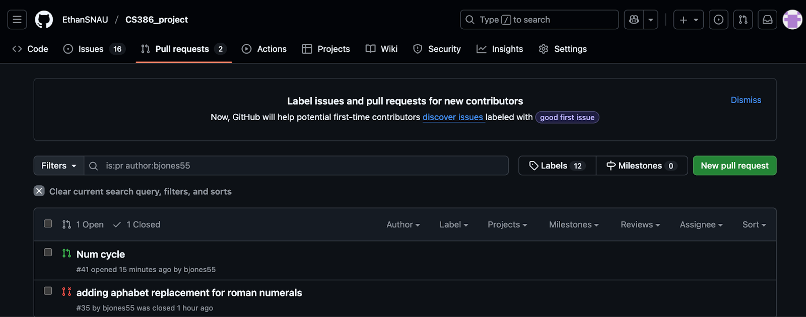

### 2.2.1 Added swap between alphabet and roman numerals

**Requirement**: As a musician, I want to be able to toggle the chord progression symbols between roman numerals and notes so that reading it is easier  
**Issue**: [https://github.com/EthanSNAU/CS386\_project/issues/28](https://github.com/EthanSNAU/CS386_project/issues/28)   
**Pull request:** [https://github.com/EthanSNAU/CS386\_project/pull/40](https://github.com/EthanSNAU/CS386_project/pull/40)   
**Implemented by**: Benjamin Jones  
**Approved by**: Ethan Sudol   
**Automated Tests**: [https://github.com/EthanSNAU/CS386\_project/blob/main/tests/unit/romanNumGen.test.js](https://github.com/EthanSNAU/CS386_project/blob/main/tests/unit/romanNumGen.test.js)  
**Visual evidence**:   
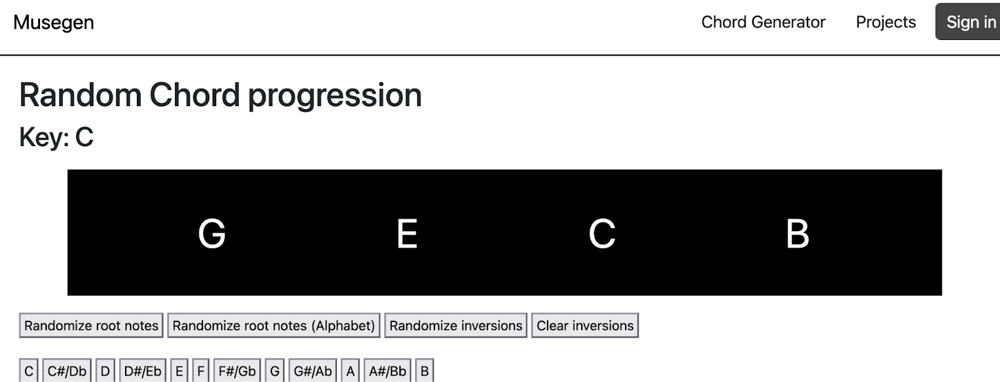

### 2.2.2 Added cycle between chosen number of chord progressions

**Requirement**: As a musician, I want to be able to toggle the chord progression symbols between roman numerals and notes so that reading it is easier  
**Issue**: [https://github.com/EthanSNAU/CS386\_project/issues/28](https://github.com/EthanSNAU/CS386_project/issues/28)   
**Pull request**: [https://github.com/EthanSNAU/CS386\_project/pull/40/commits](https://github.com/EthanSNAU/CS386_project/pull/40/commits)   
**Implemented by**: Benjamin Jones  
**Approved by**: Ethan Sudol   
**Automated Tests**: [https://github.com/EthanSNAU/CS386\_project/blob/main/tests/unit/romanNumGen.test.js](https://github.com/EthanSNAU/CS386_project/blob/main/tests/unit/romanNumGen.test.js)  
**Visual evidence**:  
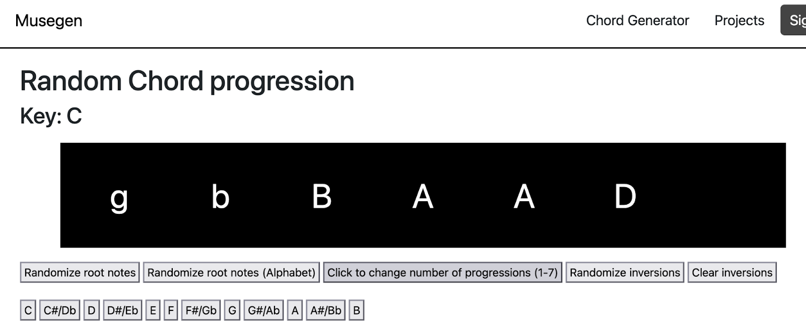

## 2.3 Christofer Vega

**Pull requests**: [https://github.com/EthanSNAU/CS386\_project/pull/40](https://github.com/EthanSNAU/CS386_project/pull/40)   
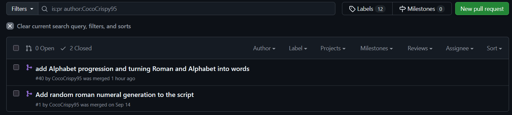

### 2.3.1 Added Conversion of Roman Numerals into Words

**Requirement**: As a musician, I want a tool to convert roman numerals to chord names so that I can work on my chord naming proficiency  
**Issue**: [https://github.com/EthanSNAU/CS386\_project/issues/14](https://github.com/EthanSNAU/CS386_project/issues/14)   
**Pull request**: [https://github.com/EthanSNAU/CS386\_project/pull/40](https://github.com/EthanSNAU/CS386_project/pull/40)   
**Implemented by**: Christofer Vega and Marcus Luca  
**Approved by**: Ethan Sudol  
**Automated Tests**: [https://github.com/EthanSNAU/CS386\_project/blob/main/tests/unit/romanNumGen.test.js](https://github.com/EthanSNAU/CS386_project/blob/main/tests/unit/romanNumGen.test.js)   
**Visual evidence**:   

### 2.3.2 Added Conversion of Letter Chords into Words

**Requirement**: As a musician, I want a tool to convert alphabetical chord symbols to chord names so that I can work on my chord naming proficiency  
**Issue**: [https://github.com/EthanSNAU/CS386\_project/issues/39](https://github.com/EthanSNAU/CS386_project/issues/39)   
**Pull request**:[https://github.com/EthanSNAU/CS386\_project/pull/40](https://github.com/EthanSNAU/CS386_project/pull/40)   
**Implemented by**: Christofer Vega and Marcus Luca   
**Approved by**: Ethan Sudol  
**Automated Tests**: [https://github.com/EthanSNAU/CS386\_project/blob/main/tests/unit/romanNumGen.test.js](https://github.com/EthanSNAU/CS386_project/blob/main/tests/unit/romanNumGen.test.js)   
**Visual evidence**:  

## 2.4 Ethan Sudol

**Pull requests**: https://github.com/EthanSNAU/CS386\_project/pulls/EthanSNAU  
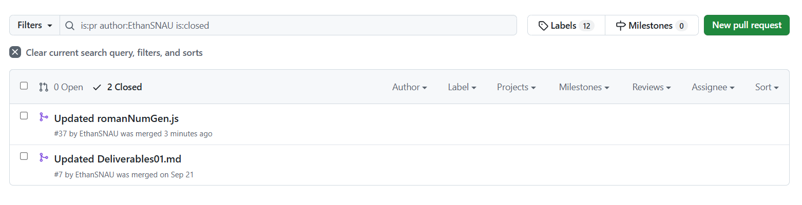

### 2.4.1 Musical Scale selection

**Requirement**: As a musician, I want to decide the key of the chord progression, so that I can narrow in on the emotional tonality I desire  
**Issue**: [https://github.com/EthanSNAU/CS386\_project/issues/9](https://github.com/EthanSNAU/CS386_project/issues/9)  
**Pull request**: [https://github.com/EthanSNAU/CS386\_project/pull/37](https://github.com/EthanSNAU/CS386_project/pull/37)  
**Implemented by**: Ethan Sudol  
**Approved by**: Ethan Sudol  
**Automated Tests**: [https://github.com/EthanSNAU/CS386\_project/blob/main/tests/unit/romanNumGen.test.js](https://github.com/EthanSNAU/CS386_project/blob/main/tests/unit/romanNumGen.test.js)  
**Visual evidence**:  
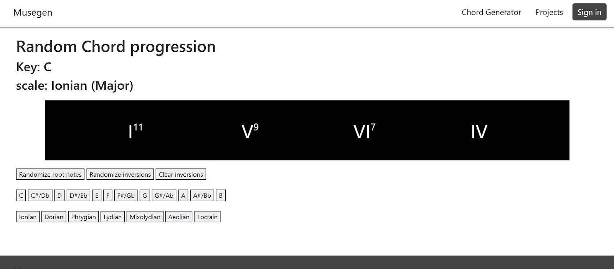

### 2.4.2 Chord Extensions

**Requirement**: As a musician, I want to be able to quickly change chords to be 7ths, 9ths, and 11ths so I can have more dimension in my chords  
**Issue**: [https://github.com/EthanSNAU/CS386\_project/issues/36](https://github.com/EthanSNAU/CS386_project/issues/36)  
**Pull request**: [https://github.com/EthanSNAU/CS386\_project/pull/37](https://github.com/EthanSNAU/CS386_project/pull/37)  
**Implemented by**: Ethan Sudol  
**Approved by**: Ethan Sudol  
**Automated Tests**: [https://github.com/EthanSNAU/CS386\_project/blob/main/tests/unit/romanNumGen.test.js](https://github.com/EthanSNAU/CS386_project/blob/main/tests/unit/romanNumGen.test.js)  
**Visual evidence**:  

## 2.5 Marcus Luca

**Pull requests**: [https://github.com/EthanSNAU/CS386\_project/pull/40](https://github.com/EthanSNAU/CS386_project/pull/40)    

### 2.5.1 Added Conversion of Roman Numerals into Words

**Requirement**: As a musician, I want a tool to convert roman numerals to chord names so that I can work on my chord naming proficiency  
**Issue**: [https://github.com/EthanSNAU/CS386\_project/issues/14](https://github.com/EthanSNAU/CS386_project/issues/14)   
**Pull request**: [https://github.com/EthanSNAU/CS386\_project/pull/40](https://github.com/EthanSNAU/CS386_project/pull/40)   
**Implemented by**: Christofer Vega and Marcus Luca  
**Approved by**: Ethan Sudol  
**Automated Tests**: [https://github.com/EthanSNAU/CS386\_project/blob/main/tests/unit/romanNumGen.test.js](https://github.com/EthanSNAU/CS386_project/blob/main/tests/unit/romanNumGen.test.js)   
**Visual evidence**:  

### 2.5.2 Added Conversion of Letter Chords into Words

**Requirement**: As a musician, I want a tool to convert alphabetical chord symbols to chord names so that I can work on my chord naming proficiency  
**Issue**: [https://github.com/EthanSNAU/CS386\_project/issues/39](https://github.com/EthanSNAU/CS386_project/issues/39)   
**Pull request**:[https://github.com/EthanSNAU/CS386\_project/pull/40](https://github.com/EthanSNAU/CS386_project/pull/40)   
**Implemented by**: Christofer Vega and Marcus Luca   
**Approved by**: Ethan Sudol  
**Automated Tests**: [https://github.com/EthanSNAU/CS386\_project/blob/main/tests/unit/romanNumGen.test.js](https://github.com/EthanSNAU/CS386_project/blob/main/tests/unit/romanNumGen.test.js)   
**Visual evidence**:  

## 2.6 Nolan Carlisle

**Pull requests**: [https://github.com/EthanSNAU/CS386\_project/issues?q=is%3Apr%20author%3ANCarlisle24](https://github.com/EthanSNAU/CS386_project/issues?q=is%3Apr%20author%3ANCarlisle24)  

### 2.6.1 Random chord generation (major and minor)
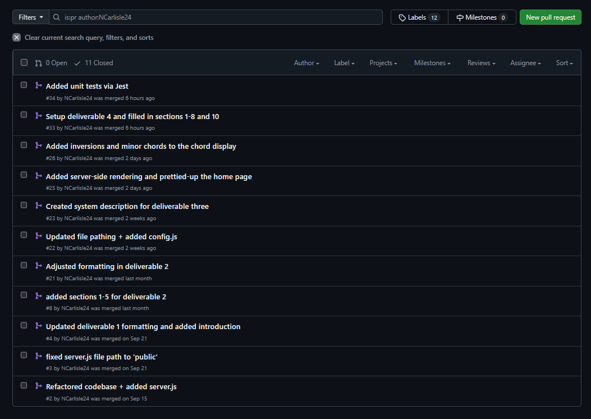

**Requirement**: As a musician , I want generate random chords so that i can quickly find inspiration for musical pieces without having to have a deep knowledge of music theory  
**Issue**: [https://github.com/EthanSNAU/CS386\_project/issues/19](https://github.com/EthanSNAU/CS386_project/issues/19)  
**Pull request**: [https://github.com/EthanSNAU/CS386\_project/pull/26](https://github.com/EthanSNAU/CS386_project/pull/26)  
**Implemented by**: Nolan Carlisle  
**Approved by**: Ethan Sudol  
**Automated Tests**: [https://github.com/EthanSNAU/CS386\_project/blob/main/tests/unit/romanNumGen.test.js](https://github.com/EthanSNAU/CS386_project/blob/main/tests/unit/romanNumGen.test.js)  
**Visual evidence**:  
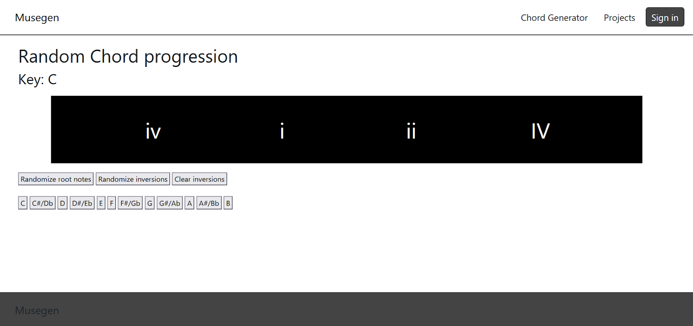

### 2.6.2 Random inversion generation

**Requirement**: As a musician, I want to use inversions so that I can get more complex emotions from my chords  
**Issue**: [https://github.com/EthanSNAU/CS386\_project/issues/13](https://github.com/EthanSNAU/CS386_project/issues/13)  
**Pull request**: [https://github.com/EthanSNAU/CS386\_project/pull/26](https://github.com/EthanSNAU/CS386_project/pull/26)  
**Implemented by**: Nolan Carlisle  
**Approved by**: Ethan Sudol  
**Automated Tests**: [https://github.com/EthanSNAU/CS386\_project/blob/main/tests/unit/romanNumGen.test.js](https://github.com/EthanSNAU/CS386_project/blob/main/tests/unit/romanNumGen.test.js)  
**Visual evidence**:  
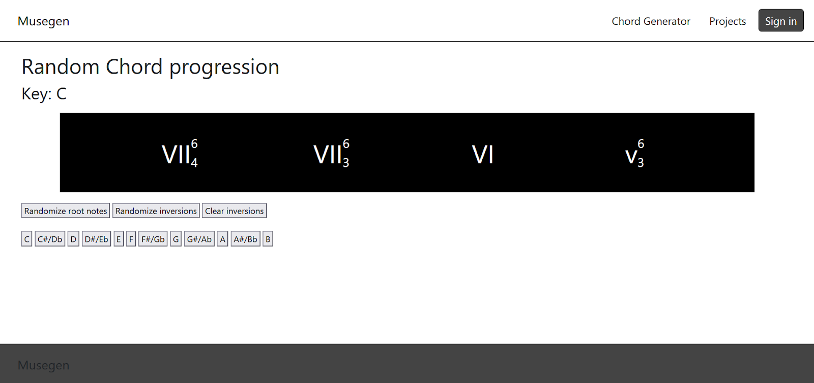

# 3\. Automated Testing

## 3.1 Testing Framework

**Name**: Jest  
**Reason**: Jest grants the ability to simulate DOM elements, allowing unit/integration tests to check if display elements are being updated properly.  Additionally, in case the project scope ever expands, it offers support for many heavier frameworks (i.e. React).  
**Location**: [https://github.com/EthanSNAU/CS386\_project/tree/tests](https://github.com/EthanSNAU/CS386_project/tree/tests)

## 3.2 Example

**Test performed**: [https://github.com/EthanSNAU/CS386\_project/blob/main/tests/unit/romanNumGen.test.js](https://github.com/EthanSNAU/CS386_project/blob/main/tests/unit/romanNumGen.test.js)  
**Code tested**: [https://github.com/EthanSNAU/CS386\_project/blob/main/src/public/scripts/romanNumGen.js](https://github.com/EthanSNAU/CS386_project/blob/main/src/public/scripts/romanNumGen.js)  
**Explanation**: genRomanNumeral() is supposed to do two things: Randomly generate a string of Roman numerals (from I to VII) and update the chord progression display.  In the test below, Jest made sure that genRomanNumeral() generated the right number of chords (four in this case), returned a string of valid Roman numerals, and updated the correct display elements.  
**Results**:  
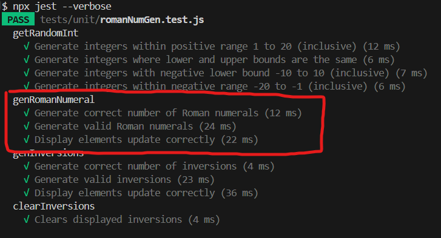

# 4\. Technology Stack

## 4.1 HTML and CSS

**Description**: HTML and CSS are structuring languages used to create frontend elements for Musegen.

**Justification**: Both technologies are vital to serving web applications that can run on most devices. They also presented the easiest learning curve, as most members were already familiar with them.

## 4.2 JavaScript (Node)

**Description**: JavaScript is the programming language used to set up the server/API of Musegen.  This includes setting up middleware and dynamically modifying HTML/CSS when necessary.

**Justification**: Despite having its flaws, JavaScript is widely used, resulting in robust package support via Node.  Additionally, it has the ability to interact with both frontend and backend elements, which greatly simplifies the learning process and maintains a uniform technology stack.

## 4.3 ExpressJS

**Description**: ExpressJS serves as the web framework for Musegen, allowing easy access to middleware modification and rendering engines.

**Justification**: Due to its minimalism, ExpressJS works well for Musegen thanks to the latter’s (relatively) small scale. It offers a low level of control over middleware without weighing team members down with overly-repetitive semantics.

## 4.4 Embedded JavaScript (EJS)

**Description**: EJS is the view engine used by Musegen to simplify HTML creation.  Its main use is in maintaining DRY, supporting templates that can be reused in any HTML file.

**Justification**: The rendering engine transpiles JavaScript to raw HTML, offering just as much control over UI as JavaScript does. This allows team members to take advantage of DRY and makes the technology stack as uniform as possible.

## 4.5 WebAudio API

**Description**: Though not implemented yet, the WebAudio API grants the ability to play notes.

**Justification**: Musegen’s goal is to support MIDI exporting, meaning low-level control of individual notes is absolutely necessary.  WebAudio API provides this (down to the timbre, pitch, and length) whereas other frameworks tend to abstract these features away.

# 5\. Learning Strategy

The team acquired many technical skills throughout the development of Musegen.  Major strategies include the following:

* Not being afraid to search something up  
* Creating a Discord channel dedicated to development questions  
* Getting in a call or meeting with each other when development is particularly difficult  
* Supporting each others’ decisions to learn independently or together when requested  
* Creating quick prototypes to test acquired knowledge

## 5.1 Major Challenges

### 5.1.1 Learning how to play music

**Problem**: Playing music via JavaScript is surprisingly difficult, so much so that playing chord progressions was delayed multiple times.

* Primary options included MIDI and a multitude of other frameworks/formats  
* Translating chords to playable file formats brings its own host of difficulties

**Solution**: A proof of concept for playing and converting notes to playable files is being collaborated on.

### 5.1.2 Learning music theory

**Problem**: Due to the nature of Musegen, it became clear that understanding basic music theory is, to some extent, a prerequisite to understanding why certain features are designed the way they are.  To encourage design collaboration, team members needed to learn about chord progressions.

**Solution**: Team members that had no experience with music theory grouped together to learn and share insights, including learning resources.

### 5.1.3 Deciding between OOP and functional programming

**Problem**: Music consists of multiple layers of elements, including notes, chords, measures, sections, and so on.  Every element has its own properties and methods, so deciding between OOP and functional programming was difficult.

* OOP would make it easy to replicate functionality at the cost of spaghetti code  
* Functional programming would keep it simple while potentially violating DRY principles

**Solution**: Team members took the time to discuss it over several meetings. Through a unanimous vote, it was eventually decided that functional programming would be used until the scope grows, at which point the discussion will be revisited.

## 5.2 Time spent learning technologies

**HTML and CSS**: 2 hours (mainly looking up documentation)  
**JavaScript**: 1 hour (same as above)  
**ExpressJS**: 3 hours  
**Embedded JavaScript**: 5 hours  
**WebAudio API**: 12 hours and counting

## 5.3 Learning Resources Used

**Embedded JavaScript Documentation**: [https://ejs.co/\#docs](https://ejs.co/#docs)  
**Express 5.x Documentation**: [https://expressjs.com/en/5x/api.html](https://expressjs.com/en/5x/api.html)  
**GeeksForGeeks**: [https://www.geeksforgeeks.org](https://www.geeksforgeeks.org)

* Used for a little bit of everything

**List of common chord progressions (HookTheory)**: [https://www.hooktheory.com/theorytab/common-chord-progressions](https://www.hooktheory.com/theorytab/common-chord-progressions)  
**MDM Web Docs**: [https://developer.mozilla.org/en-US/](https://developer.mozilla.org/en-US/)

* Documentation for HTML, CSS, and JS packages (i.e. WebAudio API)

**Music theory course**: [https://www.musictheory.net/lessons](https://www.musictheory.net/lessons)

# 6\. Deployment

**Live System Link**: [https://musegen.vercel.app](https://musegen.vercel.app)  
**Deployment Method**: Vercel is set up so that it tracks the main branch of a Git repository.  Musegen uses ExpressJS as the middleware, so “deploying” Musegen really means running server.js on one of Vercel’s servers. Whenever a commit is made to the main branch, Vercel redeploys the app automatically.  For deliverables (where a certain version of the app is to be submitted), a clone of the original repository is made and linked to Vercel.  
**Platform Justification**: Vercel is simple and free.  As Musegen uses ExpressJS to deliver pages, Vercel presents itself as an attractive option due to supporting ExpressJS and automatically tracking changes on GitHub (reducing time spent redeploying).

# 7\. Licensing

**License used**: MIT License  
**Justification**: Team members agreed that they don’t care too much about what other people do with Musegen’s code. As such, a simple and permissive license was used.

# 8\. Repository Documentation

**README.md**: [https://github.com/EthanSNAU/CS386\_project/blob/main/README.md](https://github.com/EthanSNAU/CS386_project/blob/main/README.md)  
**LICENSE**: [https://github.com/EthanSNAU/CS386\_project/blob/main/LICENSE.txt](https://github.com/EthanSNAU/CS386_project/blob/main/LICENSE.txt)

# 9\. User Interface Design

Our visual design was constructed around the idea of being a clear, concise, yet stylish application. In terms of hierarchy, although we went for stylish minimalism, the style is primarily designed for functionality. Form serving function if you will.

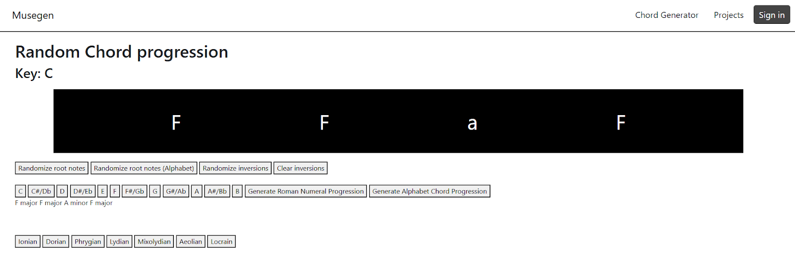

As you can see, the chord progression display looks sleek but we have giant buttons for the user to clearly and quickly modify the parameters of the program. Additionally as you can see, everything is large and high contrast for maximum visibility. It also uses a timeless monochromatic color scheme so that the user knows they are using a serious tool.

# 10\. Retrospective Analysis

## 10.1 Key Learnings

The team made some major discoveries during the development of Musegen:

* Time estimates tend to vary in error a lot.  Overestimating the required time is a better practice  
* Function documentation is a lifesaver and takes less time to implement than previously thought  
* Unit tests should be used for development on any heavier features due to the time saved  
* Declaring constant variables is always better than magic values

## 10.2 Challenges Overcome

### 10.2.1 Communication overhead

**Problem**: Team members were often busy throughout the development process, especially as classes began warming up.  This meant that development notifications would often go unseen for upwards of several days, which was especially bad when trying to get code reviewed.

**Solution**: Start development early to allocate an adequate amount of time for other team members.  If messages are sent asking to do something more involved (such as get in a call or review code), a response should be made saying that the team member is currently busy and will get to it when they get the chance.

### 10.2.2 File mismatching

**Problem**: When collaborating on deliverables, team members would often use different methods of adding their changes, such as directly via GitHub, converting Google Docs to Markdown, and using external programs.  This became a big issue when it came to attaching images and links.

**Solution**: All images are uploaded to an image folder in GitHub that the uploaded Markdown file uses to display images (unless otherwise agreed upon).  Any text editor is fine as long as all links are in the format “\[text\](link)”.

### 10.2.3 Design disagreements

**Problem**: Designing the app’s structure and look were often points of contention throughout the development process.  This includes how the file system was laid out, whether OOP or FP should be used, and how to best serve files to the end user.

**Solution**: Team meetings are held to discuss and debate different sides of the problem.  Optimally, team members eventually arrive at a unanimous decision, but if there is no movement from any side, the team holds a vote and moves forward accordingly.

## 10.3 Future Improvements

Future improvements to Musegen include the following:

* Add the ability to play music  
* Add the ability to export music  
* Make the chord progression editor more dynamic  
  * Dynamically insert/remove chords  
* Add projects

# 11\. System Demonstration
[https://nau.zoom.us/rec/share/GEGezT28O51cL-kvobgcBzQE6RlyxLoJG2n9z-pX6hV_2jtfheZgj_HKlLtgbY8O.90byJqQqYpWDz2fm](https://nau.zoom.us/rec/share/GEGezT28O51cL-kvobgcBzQE6RlyxLoJG2n9z-pX6hV_2jtfheZgj_HKlLtgbY8O.90byJqQqYpWDz2fm)